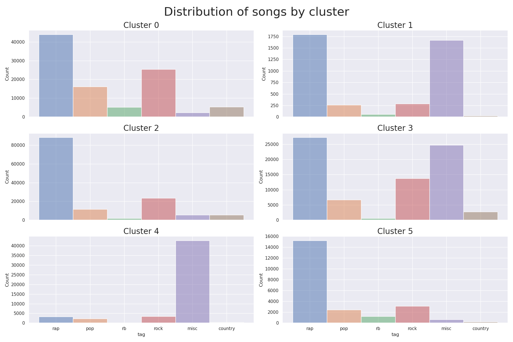

# RTG #1: Song Lyrics
First entry of the Road to Grandmaster series. You can check the acompanying blog post [here](https://pacifis.org/rtg1). In this one we dealt with song lyrics using the [5 millions song lyrics dataset](https://www.kaggle.com/datasets/nikhilnayak123/5-million-song-lyrics-dataset), which contains data scraped from Genius. The main objective was to use the infomation from the lyrics alone to find a way to cluster song by genre (like "pop", "rock", "rap", etc.).

In this repository we analyze only a fraction of the dataset containing 500000 songs. To download the data you can run the script `data/get_data.py`. It assumes you have your Kaggle API token (kaggle.json file) in the folder `~/.kaggle`. 

